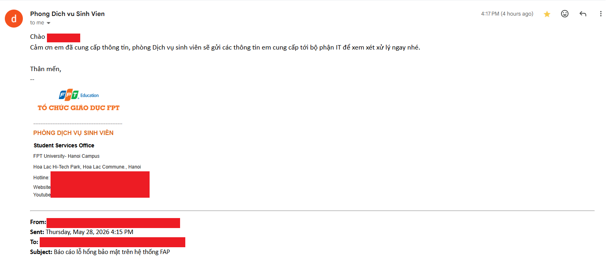

# Case Study: Excessive Data Exposure (CWE-213) in Academic Portal Architecture

[Đọc bản tiếng Việt tại đây](#bản-tiếng-việt) | [Read the English version below](#english-version)

Báo cáo đã được tiếp nhận và xử lý nhanh chóng bởi ban quản lý:
The disclosure report was promptly acknowledged and escalated by the administration:


---

## Bản Tiếng Việt
## Tổng quan
Kho lưu trữ này tài liệu hóa quá trình phát hiện, phân tích và thực hiện báo cáo lỗ hổng **Lộ lọt dữ liệu (Excessive Data Exposure - CWE-213)** (tương ứng với tiêu chuẩn danh mục **OWASP API3:2019**) được tìm thấy trong kiến trúc cổng thông tin học thuật nội bộ. (https://fap.fpt.edu.vn/)

Lỗ hổng này cho phép người dùng đã xác thực hệ thống có thể thu thập các cấu trúc dữ liệu nhạy cảm chưa được ẩn danh — bao gồm địa chỉ email người dùng và các mã định danh tích hợp hệ thống nội bộ — xuất phát từ việc thiết lập mô hình chiếu dữ liệu (data projection) quá lỏng lẻo ở phía backend.

> **Trạng thái:** Đã khắc phục và vá lỗi thành công trong vòng 2 giờ sau khi nhận báo cáo.

---

## Ngữ cảnh và việc phát hiện
Trong quá trình xây dựng một tính năng tối ưu cho dự án tiểu luận trên lớp (yêu cầu khả năng xác thực tự động mã số định danh sinh viên), tôi đã tiến hành phân tích hành vi của các endpoint thuộc hệ thống xếp lịch và đặt phòng nội bộ của nhà trường.

Thay vì chỉ tin tưởng vào các giới hạn hiển thị trên giao diện người dùng (UI Constraints), việc kiểm tra chuyên sâu ở lớp mạng (Network Layer) cho thấy API phía backend đang truyền tải các gói tin dữ liệu (payload) quá dư thừa, chứa nhiều trường thông tin hoàn toàn không cần thiết cho tầng hiển thị.

* **Phát hiện & Phân tích:** Tháng 5, 2026
* **Gửi báo cáo lỗ hổng:** Tháng 5, 2026
* **Triển khai vá lỗi:** Tháng 5, 2026 (Endpoint đã được giới hạn; các trường dữ liệu nhạy cảm đã bị loại bỏ khỏi chuỗi JSON trả về).

---

## Phân tích kỹ thuật

### Thành phần bị ảnh hưởng
* **Endpoint:** `/Schedule/ActivityStudent.aspx/GetStudent`
* **HTTP Method:** `POST`
* **Kiến trúc Backend:** ASP.NET (Enterprise Layered Architecture)
* **Lớp dữ liệu lộ lọt:** `AP.BLL.ScheduleUtility+Item` (Data Transfer Object thuộc tầng Business Logic)

### Cơ chế hoạt động của lỗ hổng
Về mặt tính năng, cấu phần giao diện dropdown ở phía client-side chỉ cần một thuộc tính dạng chuỗi cơ bản để hoạt động: mã số định danh (`RollNumber`). Giao diện sẽ trả lại tên của sinh viên tìm được một cách bình thường.

Tuy nhiên, endpoint backend lại trả về một tập hợp dữ liệu được tuần tự hóa từ cấu trúc Object nội bộ. Ứng dụng đã không áp dụng bộ lọc chiếu dữ liệu hoặc làm sạch dữ liệu phù hợp, dẫn đến việc rò rỉ các siêu dữ liệu ẩn. Trong đó bao gồm cả thông tin của đội ngũ cán bộ và nhân viên trong trường - endpoint có thể trả lại tối đa 49 kết quả:

```json
{
    "d": [
        {
            "__type": "AP.BLL.ScheduleUtility+Item",
            "RollNumber": "HEXXXXXX",
            "FullName": "Nguyễn Văn A",
            "Email": nguyenvana@gmail.com
        },
        {
            "__type": "AP.BLL.ScheduleUtility+Item",
            "RollNumber": "HEXXXXXX",
            "FullName": "Nguyễn Văn B",
            "Email": nguyenvanb@gmail.com
        },
    ]
}
```

---

## English Version

## Overview
This repository documents the identification, analysis, and responsible disclosure of an **Excessive Data Exposure** vulnerability (corresponding to **OWASP API3:2019**) discovered within an enterprise academic portal environment. (https://fap.fpt.edu.vn/)

The flaw allowed authenticated users to harvest sensitive, unredacted data structures—including user email addresses and internal system integration identifiers—due to an over-permissive backend data projection model. 

> **Status:** Successfully fixed and patched within 2 hours after the report.

---

## Context and discovery 
While architecting a utility for a university class project that required automated student identifier validation, I investigated the behavior of the portal's internal scheduling and room-booking endpoints. 

Rather than relying on visual interface constraints, a low-level inspection of the application's network layer revealed that the underlying backend API was transferring bloated data payloads containing fields strictly unnecessary for the presentation layer.

* **Discovery & Analysis:** May 2026
* **Report Submitted:** May 2026
* **Remediation Pushed:** May 2026 (Endpoint successfully restricted; sensitive data fields stripped from JSON payload).

---

## Technical analysis

### Affected component
* **Endpoint:** `/Schedule/ActivityStudent.aspx/GetStudent`
* **HTTP Method:** `POST`
* **Backend Architecture:** ASP.NET (Enterprise Layered Architecture)
* **Exposed Layer:** `AP.BLL.ScheduleUtility+Item` (Business Logic Layer Data Transfer Object)

### The vulnerability mechanics
The client-side UI dropdown component only required two basic string attributes to function: a unique student identifier (`RollNumber`) and a display name (`FullName`). 

However, when querying a partial string fragment, the backend endpoint returned a serialized collection of internal data structures. The application failed to apply a proper data projection or sanitization filter, resulting in the leakage of hidden metadata attributes. This includes the information of school faulty and staffs - the endpoint could return up to 49 results:

```json
{
    "d": [
        {
            "__type": "AP.BLL.ScheduleUtility+Item",
            "RollNumber": "HEXXXXXX",
            "FullName": "John Doe",
            "Email": johndoe@gmail.com
        },
        {
            "__type": "AP.BLL.ScheduleUtility+Item",
            "RollNumber": "HEXXXXXX",
            "FullName": "Jane Doe",
            "Email": janedoe@gmail.com
        },
    ]
}
```
